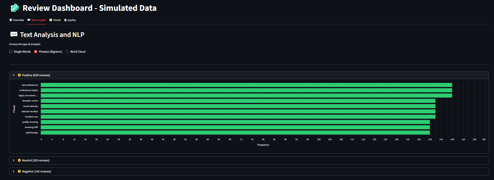
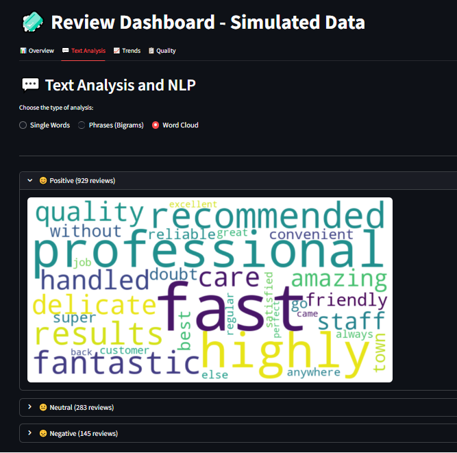
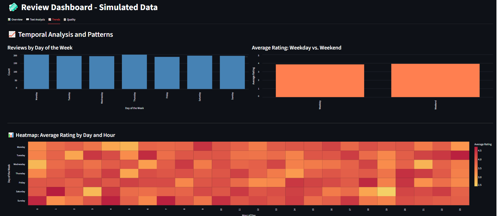

# Google Reviews ETL and Dashboard

This project demonstrates a complete ETL pipeline and an interactive dashboard for analyzing Google Maps reviews.

## Table of Contents
- [Features](#features)
- [How to Run](#how-to-run)
- [Tech Stack](#tech-stack)
- [Screenshots](#screenshots)

## Features
- **ETL Pipeline**  
  - Extract reviews from Google Maps (via SerpAPI) – or use a simulated dataset.  
  - Expected dataset columns: `review_id, date, user, rating, comment`.  
  - Transform data: clean text, normalize dates and ratings, remove stopwords.  
  - Load into a SQLite database for persistence.  

- **Dashboard (Streamlit)**  
  - **Overview**: total reviews, average rating, rating distribution, trends over time.  
  - **Sentiment Analysis**: positive/neutral/negative (rating + words) breakdown with examples.  
  - **Text Analysis**: word frequency ranking, word clouds, bigrams.  
  - **Trends**: review volume by day of week, weekday vs weekend comparison, heatmap by day and hour.  
  - **Data Quality**: duplicates, missing values, data freshness, export in CSV/Excel/JSON.  
  - **Bilingual UI**: choose between English and Portuguese dashboards.  

## How to Run
1. Clone the repository.  
2. Create a virtual environment and install dependencies.  
3. If you want to scrape data from Google, set up `.env` with your API keys.  
4. Run ETL scripts to generate and load data into SQLite.  
5. Start the dashboard:  

```bash
streamlit run dashboard_pt_br.py
```
or (for English version):

```bash
streamlit run dashboard_en_us.py
```

You can also simulate data with `/simulated_data/simulate_data.py` or directly set:

```python
DB_PATH = "simulated_data/fake_reviews.db"
TABLE_NAME = "fake_reviews"
```

in the chosen dashboard script.

## Tech Stack
- Python 3.11+  
- Streamlit, Pandas, Altair, NLTK, Wordcloud  
- SQLite  

## Screenshots

### Overview


---

### Text Analysis — 1


---

### Text Analysis — 2


---

### Text Analysis — 3


---

### Temporal Analysis


---

### Quality and Export

